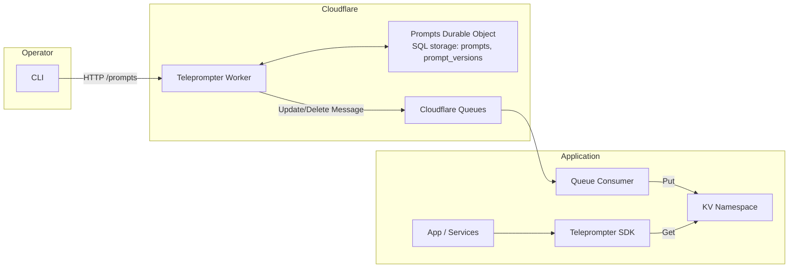
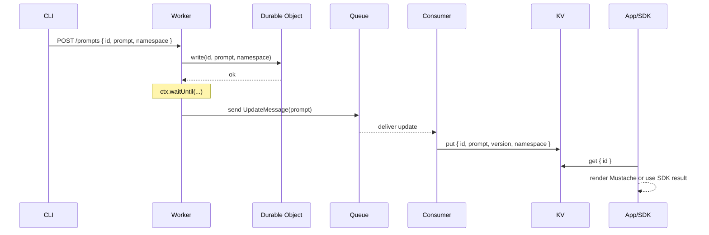

# Teleprompter Theory of Operation

## Overview
Teleprompter manages runtime prompts for LLM applications on Cloudflare. A Cloudflare Worker exposes a small HTTP API backed by a Durable Object for storage. Operators update prompts with a CLI. When a prompt changes, the Worker publishes an update to a Cloudflare Queue identified by the prompt’s namespace. Your application consumes the update, caches the prompt in KV, and serves it via the SDK or renders it directly. Prompts are Mustache templates and are append only with rollback support.

## Major Components
- Teleprompter Worker
  - Cloudflare Worker exposing REST endpoints under /prompts
  - Orchestrates writes, rollbacks, deletions, and update distribution
- Prompts Durable Object
  - Durable Object that stores current prompts and a full version history using SQL storage
  - Single instance keyed by name (idFromName("teleprompter")) for consistent state
- Cloudflare Queues
  - One or more Queue bindings in the Worker environment
  - The Prompt.namespace field must match a Queue binding key in Env
  - Update and delete messages are dispatched for downstream consumers
- CLI Tool
  - Issues HTTP calls to the Worker to list, create, update, rollback, and delete prompts
- SDK
  - TypeScript SDK used by applications to fetch prompts and construct update/delete messages
- Application Consumer
  - Queue consumer that receives updates and writes them to application KV for low-latency reads

## Architecture


## Data Model
- Prompt
  - id: string
  - prompt: string
  - namespace: string
  - version: number
- Versioning
  - version is a UNIX timestamp in milliseconds
  - Writes upsert the current row and append to prompt_versions
  - Delete removes the current row and appends a sentinel version marked as deleted
- Templates
  - Prompt text is a Mustache template rendered by your application

## Request Routing
- GET /prompts
  - Return all prompts
- GET /prompts/:id
  - Return a single prompt
- GET /prompts/:id/versions
  - Return all versions for a prompt in descending version order
- POST /prompts
  - Body: { id, prompt, namespace }
  - Create a new version for a prompt and dispatch an update message
- POST /prompts/:id/versions/:version
  - Roll back a prompt to a historical version and dispatch an update message
- DELETE /prompts/:id
  - Delete a prompt and dispatch a delete message

## Prompt Update And Distribution


- Rollback
  - POST /prompts/:id/versions/:version writes the historical prompt back as the latest and publishes an update
- Delete
  - DELETE /prompts/:id publishes a delete message which consumers use to remove from KV

## Security And Access Control
- Teleprompter uses Cloudflare Warp for access control
- The CLI stores the Access token at $HOME/.teleprompter/token with permissions 0600
- Token expiry checks are not yet enforced

## Example Requests
- List prompts
```sh
curl -s http://localhost:8787/prompts | jq
```
- Get a prompt
```sh
curl -s http://localhost:8787/prompts/homepage-hero | jq
```
- Create or update a prompt
```sh
curl -X POST http://localhost:8787/prompts \
  -H 'Content-Type: application/json' \
  -d '{
    "id": "homepage-hero",
    "prompt": "Hello {{name}}",
    "namespace": "RL_PUBLISH_FEED"
  }'
```
- Roll back to a specific version
```sh
curl -X POST http://localhost:8787/prompts/homepage-hero/versions/1731100000000
```
- Delete a prompt
```sh
curl -X DELETE http://localhost:8787/prompts/homepage-hero
```

## Related Repositories
- Worker: https://github.com/britt/teleprompter
- CLI Tool: https://github.com/britt/teleprompter-cli
- SDK: https://github.com/britt/teleprompter-sdk
